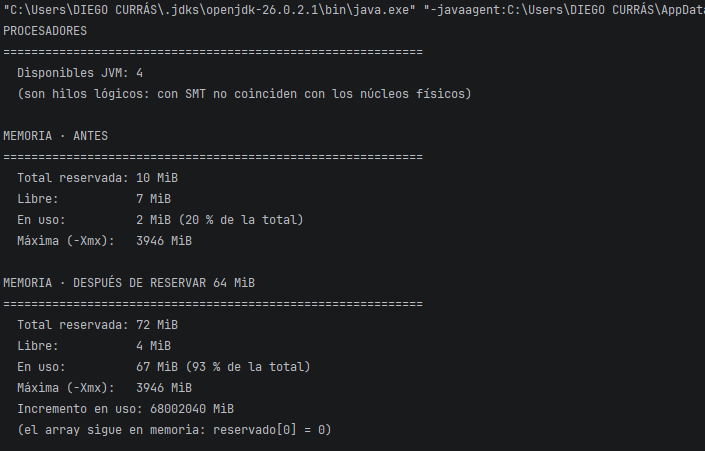
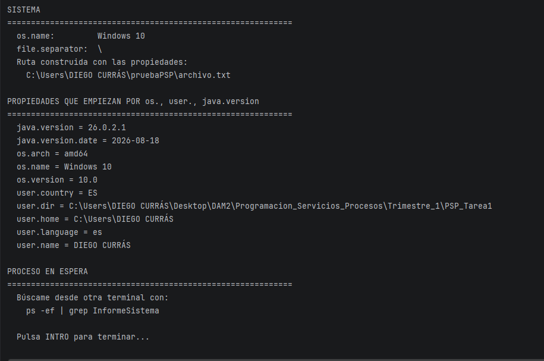

**Ejercicio 1**  
Capturas de Respuestas de programa (Procesadores, Memoria antes y despues)

Capturas de Respuesta de programa (Sistema, Propiedades)

Ahora el programa se quedara

**Ejercicio 2**

Constructor  
*C:\\Users\\DIEGOCURRÁS\\Desktop\\DAM2\\Programacion\_Servicios\_Procesos\\Trimestre\_1\\PSP\_Tarea1\>javac \-d . src/main/java/org/example/InformeSistema.java*

Ejecución del Programa en cmd  
*C:\\Users\\DIEGOCURRÁS\\Desktop\\DAM2\\Programacion\_Servicios\_Procesos\\Trimestre\_1\\PSP\_Tarea1\>java org.example.InformeSistema*

**a) Anotar PID y PPID** iniciado por terminal  
ps \-ef | grep InformeSistema  
diego       871    8 1  09:59 tty1     00:00:00 java org.example.InformeSistema

Ahora buscar el registro del padre mediante el PPID
(Captura con los 2 últimos pasos)
.png)

Con esto veremos que el padre es el \-bash

Ejecución por IDE (hecho en Linux, por eso el cambio de nombre)  
dam26   
.png)

El PID será diferente porque cada ejecución crea un proceso nuevo.  
Sin embargo, el PPID desde mi IDE también ha cambiado, ya que el padre NO ES el bash, si no el propio IDE  
ps del programa  
dam26      12344    8513  1 10:05 ?        00:00:03 /home/dam26/.jdks/openjdk-26.0.2.1

ps del padre  
dam26       8513    2888  4 09:00 ?        00:03:19 /snap/intellij-idea-community/822/bin/idea

**b) Modificar el limite de memoria**

.png)

\-Xmx128m modifica el límite máximo de memoria debido a eso cambiarán las cifras del programa.

| **Dato Memoria** | **Normal sin reserva** | **Normal con Reserva** | **-Xmx128m sin Reserva** | **-Xmx128m con reserva** |
| --- | --- | --- | --- | --- |
| totalReservada | 10MiB | 72MiB |  128MiB | 128MiB |
| Libre | 7MiB | 4MiB | 126MiB | 62MiB |
| En Uso | 2MiB | 67MiB | 1MiB | 65MiB |
| Máxima | 3946 MiB | 3946 MiB | 128 MiB | 128 MiB |

**TotalReservada**: cambia a mas debido a poner el límite con el -Xmx128m.

**Libre**: Aumenta por la misma razón, porque hay más espacio.

**En uso**: Es casi lo mismo, ya que el límite de memoria casi no influye en tanta medida, el pequeño cambio se da por necesitar un poco de memoria más por la limitación.

**Máxima**: Con el programa principal se consigue una MiB muchísimo mayor, ya que no está limitada, sin embargo la otra cumple con la limitación.

**c) Rutas**  
Al haber hecho un String con las variables de separador y home estas cambiarán

Windows  
C:\\Users\\DIEGO CURRÁS\\pruebaPSP\\archivo.txt

Linux  
/home/diego/pruebaPSP/informe.txt 

**Ejercicio 3**

● **a) Un servidor web que atiende 500 peticiones a la vez en una máquina de 8 núcleos.**   
Principalmente **programación paralela**, para realizar una tarea por cada núcleo ya que el proceso es simultáneo, pero se podría apoyar por programación concurrente, turnandose las tareas para una mayor eficiencia por cada núcleo (esto último no se me había ocurrido en primer lugar y lo encontré investigando).  
Inconveniente: Se están gestionando muchos recursos a la vez, lo que conllevará un grán consumo de recursos.

**● b) Renderizar una película de animación en un plazo de tres meses.**   
Se deberá de realizar una **programación distribuida**, debido a que las películas de animación requieren de muchísima carga y el plazo es muy corto, ya que cordinar múltiples máquinas a través de la red debería de poder realizar el proceso de forma correcta.  
Inconveniente: Este proceso de renderizado podría llegar a ser muy tardado, por lo que se necesitrían muchos dispositivos para que cumpla el plazo.

**● c) Una app de móvil que descarga un fichero mientras seguís navegando.**  
Según este caso se necesitará una **programación concurrente**, debido a que mientras que el cliente navega; la descarga se ejecutará en segundo plano turnándose, de esta forma no se interrumpirá una tarea con otra.   
Inconveniente: Con tal de que no se bloquee una tarea con la otra se deberán de gestionar correcamente para resolver este problema.

**● d) Un cálculo que no cabe en la RAM de un solo equipo.**   
Debido a la falta de capacidad de RAM en dispositivo, el siguiente paso sería usar mas dispositivos, de esta forma llegando a tener una mayor capacidad, por lo que la mejor opción es **Programación Distribuida.**    
Inconveniente: Debido a que se tienen que conectar máquinas entre sí, aumenta la complejidad e incluso puede llegar a tener problemas de latencia.